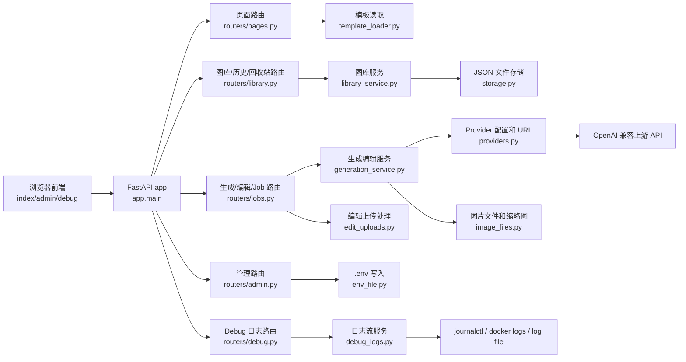
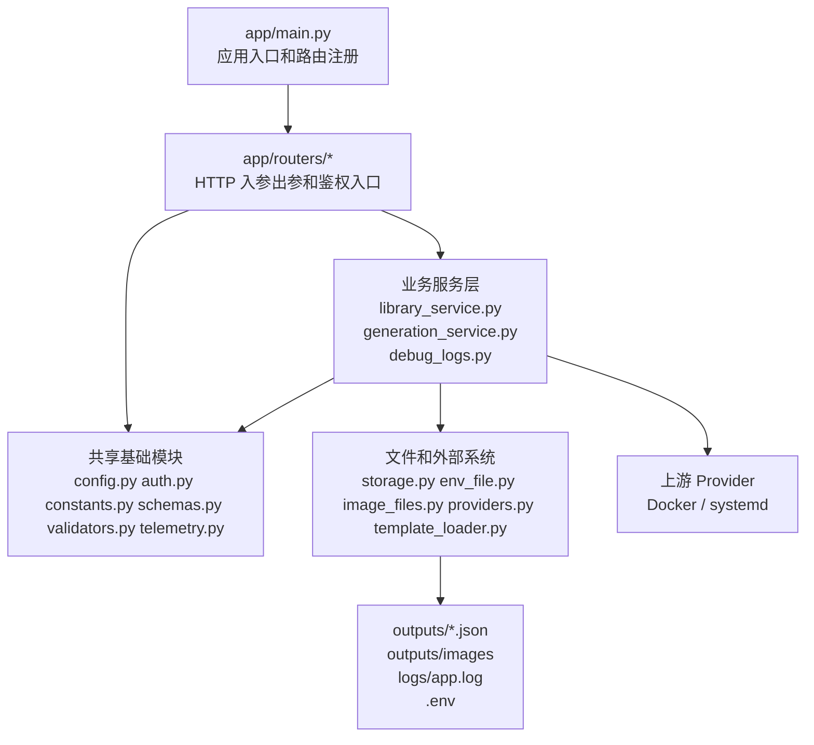

# gpt-image-2 Web Service

一个自用的 FastAPI 图片生成/编辑 Web 服务，通过 OpenAI 兼容接口调用第三方供应商的 `gpt-image-2` 模型。当前版本已经把 Generate 和 Edit 合并到同一个主页 Studio 中，独立 `/edit` 页面已移除。

## 功能概览

- 密码登录：只需要密码，不需要账户；未配置密码和 Session Secret 时会关闭鉴权。
- 统一主页 Studio：左侧选择 `Generate` 或 `Edit`，右侧展示当前结果、后台 Job 和对应模式的历史记录。
- 多 provider：主页可选择不同上游 provider；provider 名称、API Type、专用 Model、Base URL、API Key 和备注可在管理页维护，备注会在主页悬浮提示中展示。
- 文生图：支持 prompt、比例、尺寸档位、质量、输出格式、数量和 Extra JSON。
- 图片编辑：支持上传 1 到 16 张源图，可选 mask；源图会在 prompt 上方显示编号缩略图，可删除、左右调整顺序，支持和生成一致的尺寸、质量、输出格式、数量和 Extra JSON。
- Job 模式：Generate 和 Edit 都通过后台 Job 执行，关闭浏览器后任务仍会继续。
- 后台任务：任务运行中可以转入后台，继续提交新的生成或编辑任务；最多同时存在 10 个排队或运行中的 Job。
- 本地取消：前端和 API 都支持取消本地 Job；如果请求已经发给上游，provider 仍可能继续完成。
- 历史记录：生成历史和编辑历史写入同一个 `history.json`，通过 `operation` 字段区分，前端会根据当前模式自动切换展示。
- 画廊密码：创建或编辑画廊时可设置密码；受保护画廊需要解锁后才能查看、生成、编辑、移动、下载或删除其中内容，解锁有效期为 7 天。
- 画廊排序：主页画廊胶囊支持拖拽自定义顺序，刷新后仍按保存的顺序显示。
- 历史操作：支持查看、打开原图、下载、批量下载 ZIP、批量删除；生成历史和编辑历史都可以一键进入再次编辑。
- 历史元数据：记录图片文件大小、图片宽高规格、请求质量、实际质量、输出格式和状态。
- 文件保护：历史超过上限清理旧记录时，如果旧图片仍被 Job 或其他历史引用，会保留本地文件避免详情失效。
- 管理界面：`/admin` 可查看并修改常用 `.env` 配置、provider 列表、Debug 日志槽位，并可触发 systemd 服务重启。
- Debug 面板：`/debug` 支持最多 4 个可配置服务日志槽位，可监控 systemd journal、Docker 容器日志或自定义日志文件。
- 日志排查：JSONL 日志记录请求参数、上游响应、异常、重试、耗时和图片保存结果，并隐藏 API Key 和大体积 base64 内容。
- 并发安全：`history.json` 和 `jobs.json` 读写带 `fcntl` 文件锁，降低并发写入导致的数据损坏风险。

说明：当前文件锁基于 `fcntl`，适合 Linux/macOS 部署；如果要在 Windows 上运行，需要改用跨平台文件锁库。

## 服务架构

当前服务仍然是一个 FastAPI 应用，入口保持为 `app.main:app`，但 `main.py` 现在只负责创建应用、注册路由和启动事件。业务逻辑已经按职责拆到独立模块，前端调用的 URL、请求参数和响应结构保持不变。

### 请求流转



### 模块职责



主要模块说明：

- `app/main.py`：只保留 FastAPI 实例、router 注册、启动时标记中断 Job、Admin router 工厂注入。
- `app/routers/pages.py`：页面路由，包括首页、登录页、管理页、Debug 页和健康检查。
- `app/routers/library.py`：文件访问、历史、画廊、回收站、批量下载等 HTTP API。
- `app/routers/jobs.py`：生成 Job、编辑 Job、立即生成、立即编辑、Job 查询和取消。
- `app/routers/admin.py`：管理页配置 API、provider 模型探测、Docker 容器列表、systemd 重启。
- `app/routers/debug.py`：Debug 页 SSE 日志流和日志槽位列表。
- `app/library_service.py`：画廊密码、历史记录、回收站、Job 持久化、文件访问权限和 ZIP 打包。
- `app/generation_service.py`：provider 请求、重试、生成/编辑执行、响应归一化、历史写入。
- `app/edit_uploads.py`：编辑上传校验、临时源图保存、Job 上传文件恢复和清理。
- `app/debug_logs.py`：systemd、Docker、文件日志的 tail 和 SSE 输出。
- `app/config.py`、`app/constants.py`、`app/schemas.py`、`app/validators.py`：配置、常量、Pydantic 模型和通用校验。
- `app/auth.py`、`app/telemetry.py`、`app/storage.py`：登录鉴权、结构化日志/脱敏、JSON 文件锁读写。

### 和之前的差异

重构前：

- 几乎所有逻辑都集中在 `app/main.py`，包含配置读取、鉴权、路由、provider 请求、历史/Job 存储、Debug 日志、Admin 配置和模板读取。
- `main.py` 同时承担入口、路由层、业务服务层、基础设施层职责，后续改 Debug 日志或 provider 逻辑时容易误碰无关功能。
- 前端 API 虽然集中但缺少清晰边界，排查问题需要在一个大文件里跨区域跳转。

重构后：

- `app/main.py` 保持为 `uvicorn app.main:app` 的入口，但只做应用装配；功能按 router、service、infra 分层。
- HTTP 路由和业务逻辑分离：`routers/*` 只处理请求/响应，核心逻辑在 service 模块里复用。
- 配置、provider、日志、存储、图片文件、上传处理都拆成独立模块，后续维护时可以只改对应文件。
- 前端对接保持严丝合缝：路由数量、HTTP 方法、路径和 OpenAPI path/method 合同在重构前后保持一致，模板文件没有因为重构而改动。
- Debug 日志配置不再硬编码旧容器名，示例配置已经使用 `grok2api`，管理页仍可通过 Docker 容器下拉框或手动输入维护。

## 快速开始

```bash
python3 -m venv .venv
source .venv/bin/activate
pip install -r requirements.txt
cp .env.example .env
```

编辑 `.env`：

```env
OPENAI_API_KEY=你的第三方供应商 API Key
OPENAI_BASE_URL=https://你的供应商域名/v1
IMAGE_PROVIDERS=[{"id":"default","name":"默认供应商","generate_mode":"generate","edit_mode":"edit","base_url":"https://你的供应商域名/v1","api_key":"你的第三方供应商 API Key","generate_model":"你的生成模型","edit_model":"你的编辑模型","note":"显示在主页 provider 悬浮提示中的备注"},{"id":"chat-image","name":"Chat Completions 图片供应商","generate_mode":"completions","edit_mode":"completions","base_url":"https://你的聊天供应商域名/v1","api_key":"你的聊天供应商 API Key","generate_model":"你的聊天生成模型","edit_model":"你的聊天编辑模型","note":"生成和编辑都使用 /v1/chat/completions。"}]
IMAGE_MODEL=gpt-image-2

IMAGE_SIZE=1024x1024
IMAGE_QUALITY=auto
IMAGE_OUTPUT_FORMAT=png
IMAGE_RESPONSE_FORMAT=b64_json
IMAGE_EDIT_IMAGE_FIELD=image[]
OUTPUT_DIR=outputs
LOG_DIR=logs
REQUEST_TIMEOUT_SECONDS=600
PROVIDER_MAX_ATTEMPTS=2
HISTORY_LIMIT=50
MAX_ACTIVE_JOBS=10

APP_PASSWORD=你的登录密码
ADMIN_PASSWORD=你的管理页密码
# 生成方式固定为：python3 -c "import secrets; print(secrets.token_urlsafe(48))"
APP_SESSION_SECRET=把上面命令输出的随机字符串填到这里
SYSTEMD_UNIT=image-cli
DEBUG_LOG_SERVICES=[{"name":"Image CLI","type":"file","target":"logs/app.log","enabled":true},{"name":"Chat API","type":"docker","target":"grok2api","enabled":true},{"name":"Proxy API","type":"systemd","target":"cliproxyapi.service","enabled":true},{"name":"备用日志","type":"systemd","target":"","enabled":false}]
```

启动服务：

```bash
.venv/bin/uvicorn app.main:app --host 0.0.0.0 --port 8000
```

打开主页：

```text
http://127.0.0.1:8000
```

如果同时配置了 `APP_PASSWORD` 和 `APP_SESSION_SECRET`，会先进入登录页。独立 `/edit` 页面已经删除，图片编辑请在主页切换到 `Edit` 模式使用。

管理页和 Debug 页：

- `/admin`：需要先通过首页登录，再额外输入 `ADMIN_PASSWORD`。如果没有设置 `ADMIN_PASSWORD`，会回退使用 `APP_PASSWORD`。
- `/debug`：需要首页登录，可查看应用日志和外部依赖日志。

## 页面使用

### Generate 模式

1. 在左侧选择 `Generate`。
2. 选择 provider；鼠标悬浮或查看提示区可看到该 provider 在管理页配置的备注。
3. 输入 prompt。
4. 选择比例和分辨率档位，默认是 `1:1` + `1K`。
5. 选择质量、输出格式和 Count。
6. 如有 provider 自定义参数，在 Extra JSON 中填写合法 JSON 对象。
7. 点击生成后，右侧显示当前 Job 状态和生成结果。
8. 运行中可以点击后台运行，当前任务继续执行，表单立即解锁。

### Edit 模式

1. 在左侧选择 `Edit`。
2. 选择 provider；编辑请求会使用该 provider 的 Base URL 和 API Key。
3. 上传一张或多张源图，最多 16 张；支持 `png`、`jpeg`、`webp`。
4. 上传后，源图会以悬浮缩略图显示在 prompt 框上方。左上角编号就是提交给上游的顺序，`×` 可删除单张，`‹` / `›` 可把源图前移或后移。
5. 可选上传 mask。mask 用来告诉模型哪些区域可被重绘，具体语义取决于上游 provider；mask 缩略图左上角显示 `M`，也可用 `×` 删除。
6. 输入编辑 prompt。多图语义建议直接引用编号，例如“以图 2 的人物为目标，把图 1 的衣服换到图 2 上”。
7. 选择尺寸、质量、输出格式和 Count。
8. 如有 provider 自定义参数，在 Extra JSON 中填写合法 JSON 对象。
9. 点击编辑后，任务会进入 `/v1/edit/jobs` 后台 Job 流程。

Clear 按钮会按当前模式工作：Generate 模式只清空 prompt；Edit 模式会清空 prompt、源图、mask 和预览。

### 历史记录

- 主页历史会根据当前模式自动显示生成历史或编辑历史，不需要用户手动选择历史类型。
- 生成历史支持 `View`、`Edit`、删除、批量下载和批量删除。
- 编辑历史支持 `View`、`Edit`、删除、批量下载和批量删除。
- 生成历史详情里保留复用 prompt 和复制 prompt。
- 编辑历史详情里不显示复用/复制 prompt，而是显示再次编辑入口。
- 历史行和详情都会展示图片规格、文件大小、质量、格式、时间和状态。
- 从生成历史点击 `Edit` 会把该图追加为下一张编辑源图，不会覆盖当前已选源图。
- 从编辑历史点击 `Retry` 会恢复当次任务保存的多张源图、prompt 和选项，失败任务也会保留源图以便重试。

刷新页面后会保持上一次选择的 `Generate` 或 `Edit` 模式。

### 管理界面

`/admin` 用来集中维护常用运行配置。它不会绕过首页登录：用户必须先通过 `APP_PASSWORD` 登录，再输入管理密码。

管理页目前支持：

- 查看 `.env` 文件路径和当前公开配置。
- 修改常用参数，例如模型、默认尺寸、质量、输出格式、历史保留数量、最大并发 Job 数、服务名等。
- 维护 provider 列表：`id`、显示名称、API Type、专用 Model、Base URL、API Key 和备注。
- 维护 Debug 日志槽位：固定 4 个槽位；每个槽位可启用/关闭，并选择 systemd 服务或 Docker 容器。
- 保存配置到 `.env`。留空的 secret 字段不会覆盖已存在的密钥。
- 通过 `systemctl restart {SYSTEMD_UNIT}` 触发服务重启；本地开发环境没有 `systemctl` 时需要手动重启 uvicorn。

注意：provider 列表和 Debug 日志槽位保存后会立即用于新的请求；其他 `.env` 配置保存后请通过管理页重启按钮或手动重启服务生效。

### Debug 面板

`/debug` 会以 SSE 方式读取实时日志，默认每个面板加载最近 200 行并持续跟随。页面只显示已启用的日志槽位，槽位在 `/admin` 的 Debug Log Services 模块维护：

- `systemd`：手动输入服务名，后端执行 `journalctl -u {服务名} -n 200 -f --no-pager -o short-iso`。
- `Docker Container`：管理页通过 `docker ps` 读取运行中容器并做成下拉框，后端执行 `docker logs --tail 200 -f {容器名}`。
- `Log File`：手动输入日志文件路径，后端读取最近 200 行并持续跟随新增内容；相对路径按项目目录解析，例如 `logs/app.log`。

如果本地开发环境没有 Docker、Docker daemon 未运行、没有 `journalctl`、日志文件不存在，或目标服务不存在，面板会显示一次提示并关闭该日志流，避免浏览器自动重连导致刷屏。

## 环境变量

| 变量 | 说明 | 示例 |
| --- | --- | --- |
| `OPENAI_API_KEY` | 第三方供应商 API Key | `sk-...` |
| `OPENAI_BASE_URL` | OpenAI 兼容接口地址，需要包含 `/v1` | `https://example.com/v1` |
| `IMAGE_PROVIDERS` | 多 provider 配置 JSON 数组；`generate_mode` 可选 `generate` 或 `completions`，`edit_mode` 可选 `edit` 或 `completions`；可选 `generate_model` 和 `edit_model` 分别覆盖生成/编辑的上游模型 | `[{"id":"fast","name":"Fast","generate_mode":"generate","edit_mode":"edit","base_url":"https://example.com/v1","api_key":"sk-...","generate_model":"generate-model","edit_model":"edit-model","note":"速度优先"}]` |
| `IMAGE_MODEL` | 图片模型 | `gpt-image-2` |
| `IMAGE_SIZE` | 默认图片尺寸 | `1024x1024` |
| `IMAGE_QUALITY` | 默认质量 | `auto` |
| `IMAGE_OUTPUT_FORMAT` | 默认输出格式 | `png`、`jpeg` 或 `webp` |
| `IMAGE_RESPONSE_FORMAT` | 上游返回格式 | `b64_json` 或 `url` |
| `IMAGE_EDIT_IMAGE_FIELD` | 图片编辑转发给 provider 的源图字段名。官方多图示例常用 `image[]`，部分兼容供应商可能需要 `image` | `image[]` |
| `OUTPUT_DIR` | 图片、历史和 Job 数据保存目录 | `outputs` |
| `LOG_DIR` | 日志目录 | `logs` |
| `REQUEST_TIMEOUT_SECONDS` | 上游请求超时时间，单位秒 | `600` |
| `PROVIDER_MAX_ATTEMPTS` | 上游 5xx、超时、断流错误的最大尝试次数；Generate 和 Edit 共用 | `2` |
| `HISTORY_LIMIT` | 历史记录最大保留数量，生成和编辑共用同一个上限 | `50` |
| `MAX_ACTIVE_JOBS` | 同时处于 `queued` 或 `running` 的最大 Job 数 | `10` |
| `APP_PASSWORD` | Web 登录密码 | 自行设置 |
| `ADMIN_PASSWORD` | 管理页二次验证密码；为空时回退使用 `APP_PASSWORD` | 自行设置 |
| `APP_SESSION_SECRET` | Cookie 签名密钥；固定用 `python3 -c "import secrets; print(secrets.token_urlsafe(48))"` 生成，长度通常约 64 字符，最低不要低于 43 字符 | 随机长字符串 |
| `SYSTEMD_UNIT` | 管理页重启按钮使用的 systemd 服务名；未配置 `DEBUG_LOG_SERVICES` 时也会作为第一个 Debug 默认槽位 | `image-cli` |
| `DEBUG_LOG_SERVICES` | Debug 页 4 个日志槽位 JSON 数组；每项包含 `name`、`type`、`target`、`enabled`，其中 `type` 为 `systemd`、`docker` 或 `file` | `[{"name":"Image CLI","type":"file","target":"logs/app.log","enabled":true}]` |

鉴权规则：

- 只有同时设置 `APP_PASSWORD` 和 `APP_SESSION_SECRET` 时才会启用登录。
- 任意一个缺失都会关闭鉴权，并在日志里写入 `auth_disabled_warning`。
- 登录 Cookie 使用 `APP_SESSION_SECRET` 签名，当前过期时间为 7 天。
- `APP_SESSION_SECRET` 固定生成方式：`python3 -c "import secrets; print(secrets.token_urlsafe(48))"`。`48` 表示使用 48 字节随机数，输出通常约 64 个 URL-safe 字符；如果手动提供，至少保证 32 字节随机熵，也就是 token_urlsafe 输出不少于 43 个字符。
- `APP_SESSION_SECRET` 不需要记忆，也不要和 `APP_PASSWORD` 相同；更换后所有已登录 Cookie 会立即失效，需要重新登录。
- 管理页额外校验 `ADMIN_PASSWORD`；如果未配置，则使用 `APP_PASSWORD` 作为管理密码。

## 尺寸、质量和格式

网页里先选择比例，再选择 `1K`、`2K` 或 `4K` 档位，实际提交给 provider 的仍然是具体尺寸：

| 比例 | 1K 尺寸 | 2K 尺寸 | 4K 尺寸 |
| --- | --- | --- | --- |
| `1:1` | `1024x1024` | `2048x2048` | `2880x2880` |
| `3:4` | `768x1024` | `1536x2048` | `2448x3264` |
| `4:3` | `1024x768` | `2048x1536` | `3264x2448` |
| `9:16` | `576x1024` | `1152x2048` | `2160x3840` |
| `16:9` | `1024x576` | `2048x1152` | `3840x2160` |
| `21:9` | `1008x432` | `2016x864` | `3808x1632` |

自定义尺寸限制：

- 宽高范围都是 `16` 到 `4096`。
- 宽高都必须能被 `16` 整除。
- 总像素不能超过 `3840x2160` 的像素预算，也就是 `8,294,400` 像素。

质量选项：

- `auto`
- `high`
- `medium`
- `low`

输出格式选项：

- `png`
- `jpeg`
- `webp`

如果上游返回 base64 图片，后端会按最终输出格式保存为对应扩展名：`.png`、`.jpg` 或 `.webp`。历史记录里会分别展示“请求质量”和“provider 实际返回质量”，因为部分上游服务可能会自动调整实际质量。

## Job 模式

Generate 和 Edit 都走统一 Job 思想：

1. Generate 前端调用 `POST /v1/jobs` 创建任务。
2. Edit 前端调用 `POST /v1/edit/jobs` 创建任务。
3. 后端把任务写入 `outputs/jobs.json`，状态从 `queued` 进入 `running`。
4. 前端轮询 `GET /v1/jobs/{job_id}` 查看进度。
5. 任务完成后写入历史记录，并在结果区展示图片。
6. 关闭浏览器不会取消任务，重新打开网页后会继续显示未完成任务。

后台 Job 列表会定时刷新，当前前端每 10 秒拉取一次 `/v1/jobs`。后端最多允许 10 个 `queued` / `running` Job 同时存在；超过后会返回 `429 Too Many Requests`，错误类型是 `TooManyActiveJobs`。

取消任务：

```bash
curl -X POST http://127.0.0.1:8000/v1/jobs/JOB_ID/cancel
```

取消说明：

- 如果任务还没真正发给上游，可以直接本地取消。
- 如果请求已经发给上游，当前只会取消本地等待，上游 provider 可能仍会继续生成或编辑。
- 当前没有依赖 provider 的远程取消接口。
- 被取消的任务状态会写入 `outputs/jobs.json`，前端会显示取消说明。

## 历史和本地文件

生成和编辑成功后都会写入：

```text
outputs/history.json
```

后台 Job 数据保存到：

```text
outputs/jobs.json
```

图片文件默认保存到：

```text
outputs/
```

历史记录字段包括：

- `operation`：`generate` 或 `edit`。
- `prompt`：当次生成或编辑 prompt。
- `file` / `url`：本地文件地址或上游 URL。
- `source_file` / `source_files`：编辑历史的源图引用；`source_files` 按提交顺序保存多张源图。
- `size`：请求尺寸。
- `requested_quality`：请求质量。
- `actual_quality`：provider 返回的实际质量。
- `output_format`：输出格式。
- `file_size_bytes`：本地图片文件大小。
- `image_width` / `image_height` / `image_dimensions`：图片像素规格。
- `status`：`success` 或 `failed`。

删除历史记录时，后端会先从 `history.json` 移除记录，再删除对应本地图片文件；如果该文件仍被其他历史记录或 Job 结果引用，则会保留文件。当前删除不是通过 `deleted: true` 软删除实现，而是直接移除历史记录。

历史记录最多保留最近 50 个；写入第 51 个时，会自动清理最旧记录。请及时下载需要长期保存的结果。

批量下载的 ZIP 里会包含图片和对应的 `prompt.txt`。ZIP 文件会临时生成，响应结束后自动清理。

## 画廊密码

画廊配置保存在 `outputs/galleries.json`。如果设置了密码，后端只保存 PBKDF2 哈希，不保存明文密码；解锁状态通过签名 Cookie 保存 7 天，过期后需要重新输入。

默认画廊 `default` 不允许设置密码，只有新建的非默认画廊可以加密。

画廊密码依赖 `APP_SESSION_SECRET` 签名 Cookie。未配置 `APP_SESSION_SECRET` 时，不能创建或解锁受保护画廊。

## HTTP API

如果开启了 `APP_PASSWORD` 和 `APP_SESSION_SECRET`，API 也需要先登录拿到 cookie：

```bash
curl -c cookies.txt -X POST http://127.0.0.1:8000/login \
  -H "Content-Type: application/json" \
  -d '{"password":"你的登录密码"}'
```

后续请求加上：

```bash
-b cookies.txt
```

### 健康检查

```bash
curl http://127.0.0.1:8000/health
```

### 立即生成

```bash
curl -X POST http://127.0.0.1:8000/v1/generate \
  -b cookies.txt \
  -H "Content-Type: application/json" \
  -d '{
    "prompt": "一张赛博朋克风格的上海夜景，雨后霓虹，高细节",
    "provider_id": "default",
    "size": "1024x1024",
    "quality": "auto",
    "output_format": "png",
    "n": 1
  }'
```

### 立即图片编辑

```bash
curl -X POST http://127.0.0.1:8000/v1/edit \
  -b cookies.txt \
  -F image=@source.png \
  -F provider_id=default \
  -F prompt="把背景替换成暖色摄影棚，保持主体轮廓和文字不变" \
  -F size=1024x1024 \
  -F quality=auto \
  -F output_format=png \
  -F n=1
```

多源图编辑：

```bash
curl -X POST http://127.0.0.1:8000/v1/edit \
  -b cookies.txt \
  -F image=@source-a.png \
  -F image=@source-b.png \
  -F provider_id=default \
  -F prompt="把两张图中的人物合成到同一个摄影棚场景里" \
  -F size=1024x1024 \
  -F output_format=png
```

注意：这里的 `image` 是本服务接收上传文件的字段名；重复 `-F image=@...` 的出现顺序就是本服务接收和转发的源图顺序。`IMAGE_EDIT_IMAGE_FIELD` 控制的是本服务转发给上游 provider 时使用的字段名。

可选 mask：

```bash
curl -X POST http://127.0.0.1:8000/v1/edit \
  -b cookies.txt \
  -F image=@source.png \
  -F mask=@mask.png \
  -F provider_id=default \
  -F prompt="只重绘透明区域，添加柔和自然光" \
  -F size=1024x1024
```

Extra JSON 示例：

```bash
curl -X POST http://127.0.0.1:8000/v1/edit \
  -b cookies.txt \
  -F image=@source.png \
  -F provider_id=default \
  -F prompt="保留主体，替换为产品海报背景" \
  -F extra='{"provider_custom_option":"value"}'
```

### 创建生成 Job

```bash
curl -X POST http://127.0.0.1:8000/v1/jobs \
  -b cookies.txt \
  -H "Content-Type: application/json" \
  -d '{
    "prompt": "一张电影感的雪山日出，超清细节",
    "provider_id": "default",
    "size": "2048x1152",
    "quality": "auto",
    "output_format": "png",
    "n": 1
  }'
```

返回示例：

```json
{
  "id": "job_uuid",
  "operation": "generate",
  "status": "queued",
  "prompt": "一张电影感的雪山日出，超清细节",
  "payload": {
    "model": "gpt-image-2",
    "provider_id": "default",
    "prompt": "一张电影感的雪山日出，超清细节",
    "size": "2048x1152",
    "quality": "auto",
    "output_format": "png",
    "n": 1,
    "response_format": "b64_json"
  },
  "created_at": 1710000000,
  "updated_at": 1710000000
}
```

### 创建图片编辑 Job

```bash
curl -X POST http://127.0.0.1:8000/v1/edit/jobs \
  -b cookies.txt \
  -F image=@source.png \
  -F provider_id=default \
  -F prompt="把背景替换成暖色摄影棚，保持主体轮廓和文字不变" \
  -F size=1024x1024 \
  -F quality=auto \
  -F output_format=png \
  -F n=1
```

### 查看全部 Job

```bash
curl -b cookies.txt http://127.0.0.1:8000/v1/jobs
```

### 查看 Job

```bash
curl -b cookies.txt http://127.0.0.1:8000/v1/jobs/JOB_ID
```

### 取消 Job

```bash
curl -X POST -b cookies.txt http://127.0.0.1:8000/v1/jobs/JOB_ID/cancel
```

### 查看历史

```bash
curl -b cookies.txt http://127.0.0.1:8000/v1/history
```

### 查看历史详情

```bash
curl -b cookies.txt http://127.0.0.1:8000/v1/history/HISTORY_UUID
```

### 删除单条历史

```bash
curl -X DELETE -b cookies.txt http://127.0.0.1:8000/v1/history/HISTORY_UUID
```

### 批量删除历史

```bash
curl -X POST http://127.0.0.1:8000/v1/history/delete \
  -b cookies.txt \
  -H "Content-Type: application/json" \
  -d '{"ids":["history_uuid_1","history_uuid_2"]}'
```

### 批量下载历史

```bash
curl -X POST http://127.0.0.1:8000/v1/history/download \
  -b cookies.txt \
  -H "Content-Type: application/json" \
  -d '{"ids":["history_uuid_1","history_uuid_2"]}' \
  -o history-images.zip
```

### 画廊和密码

```bash
curl -b cookies.txt http://127.0.0.1:8000/v1/galleries

curl -X POST http://127.0.0.1:8000/v1/galleries \
  -b cookies.txt \
  -H "Content-Type: application/json" \
  -d '{"name":"私密画廊","password":"gallery-password"}'

curl -X POST http://127.0.0.1:8000/v1/galleries/GALLERY_ID/unlock \
  -b cookies.txt \
  -c cookies.txt \
  -H "Content-Type: application/json" \
  -d '{"password":"gallery-password"}'

curl -X POST http://127.0.0.1:8000/v1/galleries/reorder \
  -b cookies.txt \
  -H "Content-Type: application/json" \
  -d '{"ordered_ids":["gallery_id_1","default","gallery_id_2"]}'

curl -X PATCH http://127.0.0.1:8000/v1/galleries/GALLERY_ID \
  -b cookies.txt \
  -H "Content-Type: application/json" \
  -d '{"name":"新名称","password":"new-password"}'

curl -X PATCH http://127.0.0.1:8000/v1/galleries/GALLERY_ID \
  -b cookies.txt \
  -H "Content-Type: application/json" \
  -d '{"clear_password":true}'
```

受保护画廊未解锁时，相关历史、文件、Job 和移动/删除/下载接口会返回 `403 GalleryLocked`。

### 查看 provider 列表

```bash
curl -b cookies.txt http://127.0.0.1:8000/v1/providers
```

返回中不会暴露 API Key，只会返回 provider 的 `id`、`name`、`api_type`、`generate_mode`、`edit_mode`、`base_url`、`model`、`generate_model`、`edit_model`、`note` 和 `api_key_configured`。

### 管理页配置 API

管理 API 除了登录 Cookie，还需要 `x-admin-password` 请求头：

```bash
curl -b cookies.txt http://127.0.0.1:8000/v1/admin/config \
  -H "x-admin-password: 你的管理页密码"
```

保存配置：

```bash
curl -X POST http://127.0.0.1:8000/v1/admin/config \
  -b cookies.txt \
  -H "Content-Type: application/json" \
  -H "x-admin-password: 你的管理页密码" \
  -d '{
    "config": {
      "IMAGE_MODEL": "gpt-image-2",
      "HISTORY_LIMIT": "100",
      "MAX_ACTIVE_JOBS": "10"
    },
    "providers": [
      {
        "id": "default",
        "name": "Default Provider",
        "generate_mode": "generate",
        "edit_mode": "edit",
        "base_url": "https://api.example.com/v1",
        "api_key": "",
        "generate_model": "generate-image-model",
        "edit_model": "edit-image-model",
        "note": "默认线路，适合日常出图"
      },
      {
        "id": "chat-image",
        "name": "Chat Completions Image",
        "generate_mode": "completions",
        "edit_mode": "completions",
        "base_url": "https://api.chat-image.example/v1",
        "api_key": "",
        "generate_model": "chat-generate-model",
        "edit_model": "chat-edit-model",
        "note": "生成和编辑都转发到 /v1/chat/completions"
      }
    ]
  }'
```

这里 `api_key` 传空字符串时，不会覆盖 `.env` 中已有的 provider API Key。管理页的 Detect Models 会请求 provider 的 `{base_url}/models`，把返回的模型 ID 加载成下拉选项。

触发服务重启：

```bash
curl -X POST http://127.0.0.1:8000/v1/admin/restart \
  -b cookies.txt \
  -H "x-admin-password: 你的管理页密码"
```

### Debug 日志流

Debug 页内部使用这些 SSE 接口：

```bash
curl -b cookies.txt http://127.0.0.1:8000/v1/debug/log-services
curl -N -b cookies.txt http://127.0.0.1:8000/v1/debug/logs/log-1
curl -N -b cookies.txt http://127.0.0.1:8000/v1/debug/logs/log-2
```

## 供应商兼容说明

- `generate_mode=generate` 时，生成请求路径是 `{base_url}/images/generations`。
- `generate_mode=completions` 时，生成请求路径是 `{base_url}/chat/completions`，请求使用 `messages: [{"role":"user","content": prompt}]`。
- `edit_mode=edit` 时，编辑请求路径是 `{base_url}/images/edits`，使用 `multipart/form-data` 转发源图、可选 `mask` 和 prompt。
- `edit_mode=completions` 时，编辑请求路径是 `{base_url}/chat/completions`，源图和可选 mask 会作为 data URL 图片内容放进同一条 user message，并从返回的 `choices[].message.content`、`message.images`、`data` 或 `images` 中提取图片 URL / data URL / base64 图片。服务会在消息中按顺序插入 `Source image 1`、`Source image 2` 等文本标签，帮助上游模型理解多图角色。
- provider 配置里的 `generate_model` 会覆盖 Generate 上游请求的 `model`，`edit_model` 会覆盖 Edit 上游请求的 `model`；为空时使用请求里的 `model` 或全局 `IMAGE_MODEL`。旧配置里的 `model` 仍会兼容为两个模型的默认值。
- 旧配置里的 `api_type=images` 会兼容映射为 `generate_mode=generate`、`edit_mode=edit`；`api_type=chat_completions` 会兼容映射为两个模式都走 `completions`。
- 源图字段名默认是 `image[]`，可通过 `IMAGE_EDIT_IMAGE_FIELD=image` 适配部分兼容供应商。
- 使用 Bearer Token：`Authorization: Bearer {OPENAI_API_KEY}`。
- 默认要求 provider 返回 `b64_json`，服务会保存到 `outputs/` 并通过 `/files/...` 访问。
- 如果 provider 返回 `url`，服务会尝试下载图片并保存；下载失败时仍会返回原始 URL。
- 请求体或表单里的 `extra` 会合并到上游请求，可用于传 provider 的额外参数。
- Generate 和 Edit 使用同一套 provider 重试配置：`PROVIDER_MAX_ATTEMPTS`。
- 当前上传内容会读入 bytes 后再重试，因此 multipart 重试是安全的；如果未来改成流式上传，需要调整重试策略。

Extra JSON 示例：

```json
{
  "prompt": "一张产品摄影图",
  "size": "1024x1024",
  "quality": "auto",
  "extra": {
    "自定义参数": "自定义值"
  }
}
```

## 日志和排错

应用日志保存到：

```text
logs/app.log
```

查看实时日志：

```bash
tail -f logs/app.log
```

日志是 JSONL 格式，每行一个事件。会记录：

- 登录鉴权状态。
- 创建 Job。
- 开始生成或编辑。
- 发给 provider 的参数。
- provider HTTP 状态码。
- provider 返回内容。
- provider 报错内容。
- 网络、TLS、超时、断流等异常。
- 重试次数和重试原因。
- 图片保存结果和图片元数据。
- 总耗时。

常见失败含义：

- `auth_disabled_warning`：没有同时设置 `APP_PASSWORD` 和 `APP_SESSION_SECRET`，当前服务未启用登录鉴权。
- `stream disconnected before completion`：上游流式响应中断，通常是 provider 端连接、网关或模型服务不稳定。
- `stream error: ... INTERNAL_ERROR`：上游 HTTP/2 或网关内部错误，属于 provider/server 侧错误。
- `502`：本服务访问 provider 失败，或者 provider 返回异常网关错误。
- `429 TooManyActiveJobs`：当前已有 10 个排队或运行中的 Job，需要等待或取消后再提交。

如果使用 systemd 部署，也可以看服务日志：

```bash
journalctl -u image-cli -f
```

## 服务器部署

推荐用 systemd 跑 FastAPI，再用 Nginx 做 HTTPS 反向代理。

示例 `/etc/systemd/system/image-cli.service`：

```ini
[Unit]
Description=Image CLI FastAPI Service
After=network-online.target
Wants=network-online.target

[Service]
Type=simple
User=root
WorkingDirectory=/opt/image-cli
Environment=PYTHONUNBUFFERED=1
ExecStart=/opt/image-cli/.venv/bin/uvicorn app.main:app --host 0.0.0.0 --port 8000
Restart=always
RestartSec=3

[Install]
WantedBy=multi-user.target
```

启动：

```bash
sudo systemctl daemon-reload
sudo systemctl enable --now image-cli
sudo systemctl status image-cli
```

Nginx 反代示例：

```nginx
server {
    listen 80;
    server_name image.example.com;
    return 301 https://$host$request_uri;
}

server {
    listen 443 ssl http2;
    server_name image.example.com;

    ssl_certificate /etc/letsencrypt/live/image.example.com/fullchain.pem;
    ssl_certificate_key /etc/letsencrypt/live/image.example.com/privkey.pem;

    location / {
        proxy_pass http://127.0.0.1:8000;
        proxy_http_version 1.1;
        proxy_set_header Host $host;
        proxy_set_header X-Real-IP $remote_addr;
        proxy_set_header X-Forwarded-For $proxy_add_x_forwarded_for;
        proxy_set_header X-Forwarded-Proto $scheme;
        proxy_read_timeout 700s;
        proxy_send_timeout 700s;
    }
}
```

## 不要提交的文件

这些文件不应该上传到 GitHub：

- `.env`
- `.venv/`
- `outputs/`
- `logs/`
- `__pycache__/`
- `*.pyc`

当前 `.gitignore` 已经忽略这些内容。
